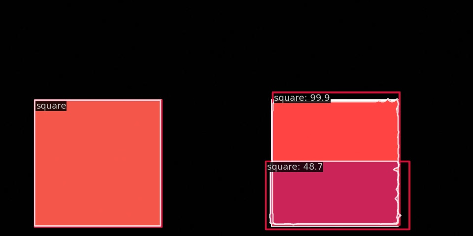

# This is an introduction to using the [mmdetection library](https://github.com/open-mmlab/mmdetection).

Our example will involve instance segmentation. We will be covering

- Installation
- Making your own toy dataset.
- Building your config.
- Training.
- Testing.

I will not explain why I am doing anything, this is more of a check to see if all your installs are working. I haven't obviously performed this exhaustively, but it should work for the configs I have discussed below.

## Installation: [[Reference]](https://mmdetection.readthedocs.io/en/latest/get_started.html)

```bash
conda create --name openmmlab python=3.8 -y
conda activate openmmlab
conda install pytorch torchvision -c pytorch #! Do not know how long this will last as Torch does not support conda anymore.
pip install -U openmim
mim install mmengine
mim install "mmcv>=2.0.0"
git clone https://github.com/open-mmlab/mmdetection.git
cd mmdetection
pip install -v -e .
```

Warning: This can be extremely tricky and I honestly got lucky. Try debugging and matching versions as you go if you face errors. Pasting errors to an LLM is a nice hacky way to mostly get the right versioning. 

### To verify

```
mim download mmdet --config rtmdet_tiny_8xb32-300e_coco --dest .
python demo/image_demo.py demo/demo.jpg rtmdet_tiny_8xb32-300e_coco.py --weights rtmdet_tiny_8xb32-300e_coco_20220902_112414-78e30dcc.pth --device cpu
```

## Build a custom dataset. [[Reference]](https://mmdetection.readthedocs.io/en/latest/user_guides/dataset_prepare.html)

```bash
mkdir data #! To store your datasets. 
cd data
mkdir dummy #! This will be out dataset for the tutorial.
```

### Making a dataset.

For people with small GPUs, this is nice bit of script to easily expand or make small datasets. <b><ins>If you want to directly start with COCO, just download the follow the details below.</b></ins>

### Creating the dummy dataset.

You can use the below code to create a simple 1 class dataset which has a black noisy background and white foreground square of different sizes.

```python
# save this as makedata.py

import os
import json
import random

import numpy as np
import cv2
from PIL import Image

def create_square(center, side_length):
    """Create a square as a polygon from center point and side length."""
    half_side = side_length / 2
    x, y = center
    # Create points in clockwise order
    points = [
        (x - half_side, y - half_side),
        (x + half_side, y - half_side),
        (x + half_side, y + half_side),
        (x - half_side, y + half_side)
    ]
    return points

def create_binary_mask(shape, polygon_points):
    """Create a binary mask from polygon points."""
    mask = np.zeros(shape[:2], dtype=np.uint8)
    # Convert points to integer for drawing
    points_array = np.array([[int(round(p[0])), int(round(p[1]))] for p in polygon_points], dtype=np.int32)
    cv2.fillPoly(mask, [points_array], 1)
    return mask

def add_noise(image, noise_level=0.1):
    """Add random noise to an image."""
    noise = np.random.normal(0, noise_level * 255, image.shape).astype(np.int16)
    noisy_image = np.clip(image.astype(np.int16) + noise, 0, 255).astype(np.uint8)
    return noisy_image

def create_dummy_dataset(output_dir, split='train', num_images=None, img_size=None, num_shapes=None, add_noise_to_images=False, noise_level=0.1):
    if not os.path.exists(output_dir):
        os.makedirs(output_dir)
    
    # Define the dataset JSON structure
    dataset_info = {
        'info': {
            'description': 'Dummy Dataset with Squares',
            'url': None,
            'version': '1.0',
            'year': 2024,
            'contributor': None,
            'date_created': '2024-08-28'
        },
        'licenses': [],
        'images': [],
        'annotations': [],
        'categories': [
            {'id': 1, 'name': 'square', 'supercategory': 'object'}
        ]
    }

    annotation_id = 1
    category_counts = {1: 0}  # Track count of square category only
    
    for img_id in range(num_images):
        image_filename = f'image_{img_id:04d}.jpg'
        if split == 'test':
            img_output_dir = os.path.join(output_dir)
        else:
            img_output_dir = os.path.join(output_dir)
        
        # Ensure directory exists
        if not os.path.exists(img_output_dir):
            os.makedirs(img_output_dir)
            
        image_path = os.path.join(img_output_dir, image_filename)
        
        # Create a black background image
        img = np.zeros((img_size[1], img_size[0], 3), dtype=np.uint8)
        
        # Determine number of shapes for this image
        shapes_in_this_image = random.randint(1, num_shapes)
        
        # Draw shapes and create annotations
        for shape_idx in range(shapes_in_this_image):
            # Always use square (category ID 1)
            shape_type = 1
            category_counts[shape_type] += 1
            # color = (random.randint(100, 255), random.randint(100, 255), random.randint(100, 255))
            color = (255, 255, 255)  # White color for square
            
            # Square
            side_length = random.randint(250, 260)
            half_side = side_length / 2
            
            # Ensure square is fully within image bounds
            center_x = random.randint(int(half_side) + 1, img_size[0] - int(half_side) - 1)
            center_y = random.randint(int(half_side) + 1, img_size[1] - int(half_side) - 1)
            center = (center_x, center_y)
            
            # Create square vertices with floating-point coordinates
            square_points = create_square(center, side_length)
            
            # Create a binary mask from the polygon
            mask = create_binary_mask(img.shape, square_points)
            
            # Draw the square directly on the image using the mask
            img[mask == 1] = color
            
            # Use mask for contour extraction
            contours, _ = cv2.findContours(mask, cv2.RETR_EXTERNAL, cv2.CHAIN_APPROX_SIMPLE)
            segmentation = []
            for contour in contours:
                contour = contour.flatten().astype(float).tolist()
                segmentation.append(contour)
            
            # Calculate bounding box from mask
            pos = np.where(mask)
            x_min = np.min(pos[1])
            y_min = np.min(pos[0])
            x_max = np.max(pos[1])
            y_max = np.max(pos[0])
            width = x_max - x_min + 1
            height = y_max - y_min + 1
            
            # Create annotation
            annotation = {
                'id': annotation_id,
                'image_id': img_id,
                'category_id': 1,  # Changed to 1 for square
                'segmentation': segmentation,
                'area': float(np.sum(mask)),  # Exact pixel count
                'bbox': [float(x_min), float(y_min), float(width), float(height)],
                'iscrowd': 0
            }
        
            dataset_info['annotations'].append(annotation)
            annotation_id += 1
    
        # Add noise if specified - AFTER annotations are created
        if add_noise_to_images:
            img = add_noise(img, noise_level)
            
        # Save image
        Image.fromarray(img).save(image_path)
        
        # Image info
        dataset_info['images'].append({
            'id': img_id,
            'width': img_size[0],
            'height': img_size[1],
            'file_name': image_filename
        })
    
    # Print category statistics
    print(f"Category distribution - Squares: {category_counts[1]}")

    # make the annotations dir if it does not exist
    if not os.path.exists('annotations'):
        os.makedirs('annotations')
    
    # Save dataset JSON for non-test splits
    if split == 'test':
        with open(os.path.join('annotations/annotations_test.json'), 'w') as f:
            json.dump(dataset_info, f)
    else:
        with open(os.path.join('annotations/annotations_train.json'), 'w') as f:
            json.dump(dataset_info, f)
    
    print(f'Dummy dataset created at {output_dir}')

# Example usage
create_dummy_dataset('train', split='train', num_images=400, img_size=(480, 480), num_shapes=1, add_noise_to_images=True, noise_level=0.01)
create_dummy_dataset('test', split='test', num_images=50, img_size=(480, 480), num_shapes=1, add_noise_to_images=True, noise_level=0.01)
```

Create the dataset by running `python makedata.py`

This should be your output if things work fine:
```
Category distribution - Squares: 400
Dummy dataset created at train
Category distribution - Squares: 50
Dummy dataset created at test
```

Your file tree should look this:
```
.
├── annotations
├── makedata.py
├── test
└── train
```

Here is a bit of code which verifies the coco structure:

```python
# Check the label of a single image
import mmengine

annotation = mmengine.load('annotations/annotations_train.json')

# First, let's examine the structure of the annotation file
print("Annotation keys:", annotation.keys())

# Try to access annotations more safely
image_id = 0  # Change this to the index of the image you want to check

# Check if the expected keys exist
has_annotations = 'annotations' in annotation
has_images = 'images' in annotation

if has_annotations and has_images:
    # Original code path
    image_annotations = annotation['annotations']
    image_info = annotation['images'][image_id]
    image_name = image_info['file_name']
    image_width = image_info['width']
    image_height = image_info['height']
    
    # Print the image information
    print(f"Image ID: {image_id}")
    print(f"Image Name: {image_name}")
    print(f"Image Width: {image_width}")
    print(f"Image Height: {image_height}")  

    # Filter annotations for this specific image
    image_annotations = [ann for ann in annotation['annotations'] if ann.get('image_id') == image_id]
    
    # Check how many annotations are in the image
    num_annotations = len(image_annotations)
    print(f"Number of annotations in the image: {num_annotations}")

    # How many classes are in the image
    classes = set()
    for ann in image_annotations:
        classes.add(ann.get('category_id'))
    print(f"Number of classes in the image: {len(classes)}")
    # Print the class names
    for class_id in classes:
        print(f"Class ID: {class_id}")

    # How many images are in the dataset
    num_images = len(annotation['images'])
    print(f"Number of images in the dataset: {num_images}")

print("\n\n")

# Checking with pycocotools
from pycocotools.coco import COCO

# Path to load the COCO annotation file
annotation_file = 'annotations/annotations_train.json'

# Initialise the COCO object
coco = COCO(annotation_file)

# Get all category tags and corresponding category IDs
categories = coco.loadCats(coco.getCatIds())
category_id_to_name = {cat['id']: cat['name'] for cat in categories}

# Print all category IDs and corresponding category names
for category_id, category_name in category_id_to_name.items():
    print(f"Category ID: {category_id}, Category Name: {category_name}")
```

Exit the dir `cd ../../`

## Bulding your pipeline confing. [\[Reference\]](https://github.com/open-mmlab/mmdetection/blob/main/demo/MMDet_InstanceSeg_Tutorial.ipynb)

As you know, mmdet is quite proud of their modular desing through configs. Here is the most basic way to set up one.

Ideally you would want to set up a config for each data? Not really sure, up to you. For simplicity we can do that. 

```bash
cd configs
mdkir dummy
cd dummy
```

First define your base config:

```python
# save this as SELF_mask-rcnn_r50-caffe_fpn_ms-poly-3x_dummy.py
### Modify Training Config
from mmengine import Config
cfg = Config.fromfile('./configs/mask_rcnn/mask-rcnn_r50-caffe_fpn_1x_coco.py') #! Takes up around 3GB VRAM for this setting

from mmengine.runner import set_random_seed

# Modify dataset classes and color
cfg.metainfo = {
    'classes': ('square', ),
    'palette': [
        (220, 20, 60),
    ]
}

# Modify dataset type and path
cfg.data_root = './data/dummy'

cfg.train_dataloader.dataset.ann_file = 'annotations/annotations_train.json'
cfg.train_dataloader.dataset.data_root = cfg.data_root
cfg.train_dataloader.dataset.data_prefix.img = 'train/'
cfg.train_dataloader.dataset.metainfo = cfg.metainfo

## Additional modifications
# set batch size to 1
cfg.train_dataloader.batch_size = 1
# set epochs to 1
cfg.train_cfg.max_epochs = 1

cfg.val_dataloader.dataset.ann_file = 'annotations/annotations_test.json'
cfg.val_dataloader.dataset.data_root = cfg.data_root
cfg.val_dataloader.dataset.data_prefix.img = 'test/'
cfg.val_dataloader.dataset.metainfo = cfg.metainfo

cfg.test_dataloader = cfg.val_dataloader

# Modify metric config
cfg.val_evaluator.ann_file = cfg.data_root+'/'+'annotations/annotations_test.json'
cfg.test_evaluator = cfg.val_evaluator

# Modify num classes of the model in box head and mask head
cfg.model.roi_head.bbox_head.num_classes = 1
cfg.model.roi_head.mask_head.num_classes = 1

#! Did not test this as I did not want to find any weights.
# cfg.model.backbone.init_cfg = False
# cfg.load_from = 'checkpoints/mask_rcnn_r50_caffe_fpn_mstrain-poly_3x_coco_bbox_mAP-0.408__segm_mAP-0.37_20200504_163245-42aa3d00.pth'

# Set up working dir to save files and logs.
cfg.work_dir = './tutorial_exps'


# We can set the evaluation interval to reduce the evaluation times
cfg.train_cfg.val_interval = 3
# We can set the checkpoint saving interval to reduce the storage cost
cfg.default_hooks.checkpoint.interval = 3

# The original learning rate (LR) is set for 8-GPU training.
# We divide it by 8 since we only use one GPU.
cfg.optim_wrapper.optimizer.lr = 0.02 / 8
cfg.default_hooks.logger.interval = 10


# Set seed thus the results are more reproducible
# cfg.seed = 0
set_random_seed(0, deterministic=False)

# Did not want to deal with this for now.
# We can also use tensorboard to log the training process
# cfg.visualizer.vis_backends.append({"type":'TensorboardVisBackend'})

#------------------------------------------------------
config=f'./configs/dummy/mask-rcnn_r50-caffe_fpn_ms-poly-3x_dummy.py'
with open(config, 'w') as f:
    f.write(cfg.pretty_text)
```

Then run `SELF_mask-rcnn_r50-caffe_fpn_ms-poly-3x_dummy.py`

This should create `./configs/dummy/mask-rcnn_r50-caffe_fpn_ms-poly-3x_dummy.py`

Exit the dir `cd ../../`

## Train
Run: `python tools/train.py configs/dummy/mask-rcnn_r50-caffe_fpn_ms-poly-3x_dummy.py`

## Test [[Reference]](https://mmdetection.readthedocs.io/en/latest/user_guides/test.html)
Run: `python tools/test.py configs/dummy/mask-rcnn_r50-caffe_fpn_ms-poly-3x_dummy.py tutorial_exps/epoch_1.pth --show-dir tutorial_exps/testshow/`

The results should be saved in the dir you put as the args for `--show-dir`, BUT (so weird lol), it will be under the timestamp.

Your `tutorial_exps` dir should look something like this:

```bash
.
├── 20250404_081604
│   ├── 20250404_081604.log
│   └── vis_data
│       └── config.py
├── 20250404_082022
│   ├── 20250404_082022.log
│   └── vis_data
│       ├── 20250404_082022.json
│       ├── config.py
│       └── scalars.json
├── 20250404_082644
│   ├── 20250404_082644.log
│   ├── tutorial_exps
│   │   └── testshow
│   │       ├── image_0000.jpg
│   │       ├── image_0001.jpg
│   │       ├── image_0002.jpg
│   │       ├── image_0003.jpg
│   │       ├── image_0004.jpg
│   │       ├── image_0005.jpg
│   │       ├── image_0006.jpg
│   │       ├── image_0007.jpg
│   │       ├── image_0008.jpg
│   │       ├── image_0009.jpg
│   │       ├── image_0010.jpg
│   │       ├── image_0011.jpg
│   │       ├── image_0012.jpg
│   │       ├── image_0013.jpg
│   │       ├── image_0014.jpg
│   │       ├── image_0015.jpg
│   │       ├── image_0016.jpg
│   │       ├── image_0017.jpg
│   │       ├── image_0018.jpg
│   │       ├── image_0019.jpg
│   │       ├── image_0020.jpg
│   │       ├── image_0021.jpg
│   │       ├── image_0022.jpg
│   │       ├── image_0023.jpg
│   │       ├── image_0024.jpg
│   │       ├── image_0025.jpg
│   │       ├── image_0026.jpg
│   │       ├── image_0027.jpg
│   │       ├── image_0028.jpg
│   │       ├── image_0029.jpg
│   │       ├── image_0030.jpg
│   │       ├── image_0031.jpg
│   │       ├── image_0032.jpg
│   │       ├── image_0033.jpg
│   │       ├── image_0034.jpg
│   │       ├── image_0035.jpg
│   │       ├── image_0036.jpg
│   │       ├── image_0037.jpg
│   │       ├── image_0038.jpg
│   │       ├── image_0039.jpg
│   │       ├── image_0040.jpg
│   │       └── image_0041.jpg
│   └── vis_data
│       └── config.py
├── epoch_1.pth
├── last_checkpoint
└── mask-rcnn_r50-caffe_fpn_ms-poly-3x_dummy.py

8 directories, 53 files
```

Hope this helped :)

# Sample Bad Ouput



# Sample Good Output

